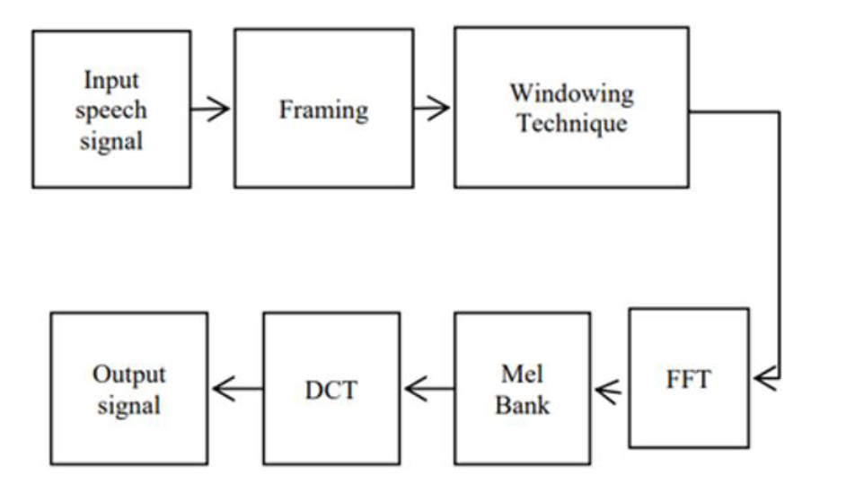

# Automatic Speaker Recognition & Verification

This project is a scope of research in the relative Academic Course "Sound and Image Technology" taught in the Autumn of 2019-2020 in Aristotle University of Thessaloniki - Electrical & Computer Engineering.  The project was  written in Matlab and Rapid Miner was also used for Machine Learning Algorithms.

Automatic Speaker Recognition is the process of identifying a speaker based on specific information contained in sound waves, in order to identify the speaker from controlled access systems. It is used to answer the question "Who speaks when?" 

## Abstract

Speaker recognition is the identification of a person based on the characteristics of his voice. There are two categories of speaker recognition: speaker identification and speaker verification. 

    

<u>Speaker identification is used to identify the speaker.</u> The model chooses from a collection of a known voice set. There are two types of the application above. The first one is the identification of a closed speaker set. In that case all speakers are known to the system. The second is the identification of an open speaker set that includes previously unknown speakers. Regarding the closed set, a voice from a currently unknown speaker is analyzed by the system and is then compared to the stored speakers. The speaker is classified regarding to the one with the best features.

Speaker verification validates a specific speaker who claims an identity. The system can accept or reject this identity. The dataset an open or closed set. The system compares the voice given at the input in terms of the characteristics of the specific speaker. If the similarity is above a certain threshold then the system accepts the requested identity.

**Automatic speaker recognition is also divided into Text-Dependent and Text-Independent systems.**

In text-dependent systems, the system knows the phrase that is going to be analyzed. The same phrase should be used both for training and verification. They are generally more accurate systems.

In text-independent systems, the system has no prior knowledge of voice phrases that is going to be analyzed. The data during training and verification are different. The system is more flexible but the problem that needs to be solved is harder.

<u>Recognizing physical speech is a difficult task, as we can not "see" the sound signals. The amplitude, the pitch, the vocal emphasis, etc. are just a few characteristics used in recognition systems.</u> These characteristics are those most commonly used at these systems, as they can easily differentiate speakers.

Most audio features are mainly based on statistical metrics, which refer to time and spectral features for each recording. Statistics such as mean average, standard deviation, covariance, etc. are used in sound characteristics.

Automatic speaker recognition essentially involves analyzing speech, extracting its features, and modeling them into a vector, using different modeling techniques during the training phase, as well as sorting control records based on specific patterns during the validation phase. In this regard, two issues will be analyzed in this text. The first concerns the extraction of features and the second the assignment of certain features to a speaker.

Historically various features of the speech spectrum including real cepstral coefficients (RCC), LPC, LPCC and MFCC. Other features include PLP, Adaptive Component Weighting (ACW) and wavelength based features, which are widely used.

## Application

### Dataset

There are several datasets available on the internet for the implementation of our application. The dataset should include speech files where only one speaker, uncompressed (wav format) and long enough so that we can both train and evaluate our model.

The Dataset that was used to implement our application is VoxCeleb. VoxCeleb is an audiovisual audio and video data set consisting of short audio speech files extracted from video interviews on YouTube. It contains over 1,000,000 audio files of 7,000 speakers, with an average recording time of ~ 8 seconds .

In order to be able to use the dataset files properly the audio clips must be joined in order to create a sufficient sample mainly for the training of our model. The goal is to create audio files of about 50 seconds for training and 15 seconds for testing.

As mentioned above, VoxCeleb includes small audio files of about 8 seconds each as shown in the photo below. Audio files are sampled at 16,000 Hz.

In order to create a 45 second wav training set and a 15 second testing set respectively, the wav files must be merged together. For this purpose, the Audacity tool was used, which is a free simple audio editing software.

As shown in the screenshot above, this software is used to merge individual wav files into one file that will be used for training. The desired final training audio size should be between 50 and 60 seconds as the total duration will decrease after passing through VAD. In this way, files are created for 10 random speakers, which include a 60-second audio (~ 50 seconds after VAD) for training and 20-second files (~ 15 seconds after VAD for assessment).The files are organized in folders as in the image above so that they can be executed in MATLAB. The testing set is placed in a corresponding test folder.

Feature_extraction.m is the feature extraction function and will be discussed below. Then each file goes through VAD (the implementation and operation of VAD will be analyzed below) and then it is ready for use in MATLAB. For organization purposes and recognition of audio files, their name consists of five digits where the first indicates whether the file is intended for training (1) or for testing (2). The second digit indicates whether the file has passed VAD (1) or not (0) and the other three digits are the speaker id from VoxCeleb.

The final dataset has the following characteristics:

|                            |  Training Set  |  Testing Set  |
| -------------------------- | :------------: | :-----------: |
| ***Number of Speakers***   |  10 Speakers   |  10 Speakers  |
| ***Sampling frequency***   |     16kHz      |     16kHz     |
| ***Total duration***       | 8 minutes 40'' | 3 minutes 2'' |
| ***Duration per Speaker*** |     ~52''      |     ~20''     |
| ***Total Size***           |      16MB      |     5,8MB     |

## Voice Activity Detection (VAD)

Voice Activity Detection (VAD) is a technique used in speech processing that detects the presence or absence of human speech. The main uses of VAD are in speech coding and speech recognition. It can facilitate speech processing and can also be used to turn off certain processes during non-speech in an audio session: it can avoid unnecessary encoding / transmission of silent packets, saving network usage and bandwidth.

In this application VAD was implemented using the parameters STE (short time energy) and ZCR (Zero Crossing Rate). However, studying in depth these, as well as other parameters, we concluded that it is necessary to replace the ZCR with an alternative parameter STA (Short Term Autocorrelation).

More specifically, regarding the STE parameter, the speech signal consists of voice and silence areas. Furthermore, the energy associated with the vocal area is large compared to the silent area, which will have minimal or negligible energy. Thus, short-term energy can be used for speech, noise and silence.

    

    

In the expression above E represents energy of the signal x (m). There is little or no effectiveness of this definition for time-varying signals, such as speech. Therefore we divide our signal into small "windows" whose energy is calculated as follows:

    

 

Where w (n-m) is the time window, n is the sample in which the analysis window is centered, and N is the window length. High energy will be classified as vocal while low energy will be classified as non-vocal.

    

Short Term Autocorellation is then defined as:

    
    

This expression represents the autocorrelation of a speech segment with a specified window length. If the window size decreases the STA effect weakens. The vocal sector would be periodic and the non-vocal sector would be non-periodic in short-term autocorrelation.

    

Having settled on the parameters to be used, we followed tests on speech signals. In these tests we defined thresholds, in which each parameter had correct results. These tests also revealed the weakness of the ZCR which had different results depending on the audio signal while at the same time the others produced stable and satisfactory results.

In conclusion, the combination of these 2 parameters with the use of the correct thresholds resulted in the removal of silence from the signals and kept only the parts to which the respective speaker was speaking.

    

At this point we will analyze the 2 functions used to load the audio in Matlab and create recordings with features for each audio window. These are the **generate_dataset** and **feature_extraction** functions respectively.

* *generate_dataset:* The arguments of this function are the length of the window in seconds as well as the overlapping percentage that these time windows will have, in which the features will be exported as we will see below.

This function accesses each idxxx folder and loads the audios for the training set, Then features are created via the feature_extraction.

The same procedure follows in the test folder of the corresponding idxxx folder, in order to create the test set for each speaker. This time, however, separate sets are created for each speaker - unlike the training set.

* *feature_extraction:* The arguments of this function are the sound signal, the length of the window and the overlapping percentage that has already been given to generate_dataset by the user, as well as the labeled number of the speaker in the specific audio.

In order to speed up the process of feature extraction, the function does not run separately for each time-window of each audio, as the algorithm would have too much time complexity. (This way, creating a dataset took more than 4 hours.) Instead, windows, in which the signal has already been split are stored as column vectors in a table, and features for each column are extracted at the same time.

In this way, a fast, and autonomous creation of datasets has been achieved as the whole process now takes less than 3 minutes after simply generate_dataset with the two arguments that accompany it. It is recalled that many experimental tests had to be performed with different arguments, not only in generate_dataset, but also different characteristics, in order to acheve  encouraging results through the machine learning algorithms (which will follow below). Therefore the direct extraction of the features was a significant help in the elaboration of the project.

## Characteristics

A key point in speech recognition is the features, extracted from the audio signal. The part of feature extraction is very important as it essentially converts our audio signal into parameters, which it represents and which we can then use to further analyze and process our data. In the table below we see the final characteristics of the feature_extraction function. A brief description of the features and how they were used will follow, if necessary.

| *Characteristics*  | **Number of them** |
| :----------------: | :----------------: |
| Short Time Energy  |         1          |
| Zero Crossing Rate |         1          |
|     Roughness      |         1          |
|      Rolloff       |         9          |
|     Brightness     |         15         |
|     Regularity     |         1          |
|        MFCC        |         39         |
|     Chromagram     |         48         |
|   Tonalcentroid    |         6          |
|        Mode        |         1          |
|    Keystrength     |         24         |
|     Statistics     |         16         |
|     **Total**      |      **162**       |

* **Short Time Energy:** The energy of the signal in a given window. 

* **Zero Crossing Rate:**  The zero-crossing rate is the rate of sign-changes along a signal, i.e., the rate at which the signal changes from positive to zero to negative or from negative to zero to positive, in a given time-window.

    

* **Roughness:** It is an estimation of the sensory dissonance, or roughness, related to the beating phenomenon whenever pair of sinusoids are closed in frequency (critical band).

* **Brightness:** This feature sets a cutoff frequency and calculates the percentage of energy above that frequency. Then its results is normalized and take values between 0 and 1. It was used with 15 different cut-off frequencies from 500 Hz to 7500 Hz with a step of 500 Hz.  At this point we should remember that the maximum frequency of audio files is 8000 Hz (due to sampling frequency of 16 kHz). In this way we manage to have a very good picture of how the energy of each window is distributed with respect to frequency.

* **Roll-off:** Corresponding to the previous one, a frequency is returned so that a part of the total energy of the respective time window is below this frequency. The percentage of energy is set by the user. It is a way to estimate the amount of high frequencies in the signal. As the table above indicates, 9 different percentages of energy were used, some targeting lower (close to 30%) and some higher targets (close to 90%), as suggested by Tzanetakis and Cook, 2002. However, in many experiments with machine learning algorithms the weight of the lower percentages of energy was higher than that of the higher ones.

    

* **Irregularity**:  The irregularity of a spectrum is the degree of variation of the successive peaks of the spectrum. The formula below was used:

    

* **Mel Frequency Cepstral Coefficient (MFCC):**  The MFCC feature extraction technique is relatively easy to apply, not complicated at all and gives very good results, which is why it is the most common one. It is based on the spectral content of the voice signal, as it is recognized by human hearing. According to psychoacoustic research the human perception of the frequencies of a voice signal does not follow a linear scale. Thus, for every tone with real frequency f measured in Hz, there is a subjective tone on the mel scale, which will be analyzed below. The following figure shows the steps to extract the MFCCs. 

    

<u>1st Step:</u>
Initially the method passes the audio signal through a filter that emphasizes high frequencies. Therefore the energy at these frequencies is increased. 

<u>2nd Step:</u>

Then the signal is fragmented (frames) and each segment is multiplied with a Hamming window to ensure the smoothness of the segments.

<u>3rd Step:</u>

Fast Fourier Transform is applied to each of these windows and is multiplied by triangular-band filters. Specifically, we apply triangular filters whose center frequencies distance is equal for the low frequencies and logarithmically placed at the higher frequencies. This is the **Mel scale**, which defines linear distances below 1000Hz, and logarithmic distances above 1000Hz. The image below shows the filter layout on this scale. The number of mel bandwidth filters selected was 40. This process will also reduce the features involved. The formula that gives the frequency on the Mel scale is the following:
$$
Mel(f)=2595log(1+\frac{f}{700})
$$

    

<u>4th step</u>:

The final step in extracting the features is the calculation of MelCepstrum. Specifically, we calculate the natural logarithm of the mel spectrum, and then return it to the time domain using the Discrete Cosine Transform. The advantage of this is that the MFC coefficients will not be related to each other. The representation of the spectral content of a signal through the cepstrum gives a very good description of the spectral properties of the signal in a time-limited analysis window.

In order to take into account the changes in the envelope of the audio signals (or the change of the MFCC coefficients) 39 total MFCC characteristics were used in our application, as we see in the table below.

| *Characteristics* | **Number of them** |
| :---------------: | :----------------: |
|       MFCC        |         13         |
|    Delta-MFCC     |         13         |
| Delta-delta-MFCC  |         13         |
|     **Total**     |       **39**       |

Delta MFCCs indicate the speed of change while the delta deltas indicate the acceleration. Since we take the derivative, there will be not the same number of windows (frames) in delta and delta-delta. It actually shrinks in time our signal by 2 time-windows when we calculate these characteristics. For this reason a symmetrical extension of the windows was applied obviously without any impact  on the results of our application.

* **Chromatogram:** The chromatogram represents the distribution of energy in the signal into the twelve different tonal categories. A main property of the characteristic colors is that they capture the harmonious and melodic characteristics of the voice, while at the same time they are robust with the changes of the noises of the surrounding space. By detecting gradations that differ from an octave, color characteristics show a high degree of resistance to sound color fluctuations and are closely related to the harmony of the voice. They are also essential for applications such as music alignment and synchronization, as well as audio structure analysis.

* **Tonal Centroid:** Calculates the 6-dimensional tonal centroid vector from the chromagram. It corresponds to a projection of the chords along circles of fifths, of minor thirds, and of major thirds.

* **Mode:** Estimates the modality, i.e. major vs. minor, returned as a numerical value between -1 and +1:
  the closer it is to +1, the more major the given excerpt is predicted to be, the closer the value is to -1, the more minor the excerpt might be.

* **Keystrength:** Computes the key strength, a score between -1 and +1 associated with each possible key candidate, by computing correlation coefficients between the chromagram returned by mirchromagramand. It represents all the possible tonality candidates.

* **Statistics:** Statistical characteristics were used in both the time and the frequency domain, as well as the in chromatogram characteristics.

## Neural Network Implementation in MATLAB

In regards of the **Neural Network**, two source code files have been developed. The first file implements the search for the **optimal number of features**, with which the model will be trained, while the second concerns the implementation of the **final model**. Both files concern the creation of neural networks that get  trained with the help of **patternet** function. Specifically, **Multi-hidden  Layers Perceptrons** are used  (MLPs). This means that the number of neurons per hidden layer must be selected. After experiments, **{20.80}** was found to be the ideal number of neurons for first and second hidden layer respectively. The input of the network consists of nodes equal in number each time with the features selected, while the output consists of ten nodes one for each speaker in the data set. The arguments of the *patternet* function are described below:

- **Hidden Level Neurons (hiddenLayerSize)**: the table [20 80].

- **Training Function (trainFcn)**: the network training method, ie the way
  the weights between the neurons are updated at each iteration of the training process. ‘Trainrp’ is used, ie a **back propagation** method. The update of the weights is done with by minimizing a cost function (here the difference between actual class and prediction).

- **Performance Function (performFcn)**: a metric of network quality, using
  **crossentropy**. In information theory it counts the difference between two probability distributions. In the classification models, each record belongs with probability 1 in one class and 0 in the others. Each model estimates the probability that a record belongs to a class. Cross-entropy is the difference between the two distributions. Its minimization is identical to the maximization of the **likelihood function**.

  

	    

---

### Finding the Optimal Number of Features

This paragraph is about the source code file *Search_Optimal_Features.m* script. The basic idea of this is the use of the Relief algorithm to find important features. Specifically, the features are assigned a weight and are sorted with respect to this. The weight for each feature is calculated based on the **homogeneity of the neighborhood** of each record. If a value difference of a feature is observed in a neighboring record with the same (different) class then the weight decreases (increases) [12]. Obviously, the importance of the feature, ie whether each feature contributes to the classification results, differentiate for each machine learning algorithm that is implemented.

The procedure is described in the following steps:

- The data is loaded in a table (26244x164) and is pre-processed. Then a **unique function** is applied to them to delete any duplicates.
- The **Relieff function** is called with arguments the features of all records, their class and a parameter k that specifies the nearest neighbors for each record that will be checked by Relieff. This parameter is set to 10 (default). The output of the function is an idx table with the features sorted by importance in descending order and a table *weights* with their weights. 
- The data is shuffled using the pseudo-random number generation function
  **randperm**. Before we call the function, the command rng (0) is called, to ensure the same initialization of the random processes and get the same result in each execution of the program.
- The data must be converted to a format compatible with our network. The inverted data table is received and is divided into two parts: the first contains all lines except of the last one and corresponds to the features, ie the input, while the second contains only the last line, i.e. the actual class
  for each record. 
- An iterative process of finding the number of features is performed
  [10,20,30, .., 120] leading to a model with minimal cross-entropy. In this process is applied **5-Fold Cross Validation**. Specifically, the whole set of training is divided into five sections, in order to use four of them for training and one for verification. In each Fold, number of lines equal to the corresponding number of features are used from the input table and the result is divided into training and validation sets depending on the indices obtained by **cvpartition**. Subsequently, five neural networks are trained
  and the mean cross-entropy is calculated based on prediction of the model on the verification set. The goal is to find the model with minimum entropy. The models that were better trained, as we will see later chose from 40 to 60 features. In our case, the optimal point was found for 40 features and after a search in this neighborhood it was calculated that **47 features** train the optimal model.

	    

		

---

### Final Model Training

The script *Neural_Network_with_select_Features.m* is responsible for this process. The basic idea implemented is the training of five neural networks, each with differential part of the training set and the corporate decision for the output. 

- Initially the training set and the desired number of features are loaded, as well as the idx.mat table.
- The data is **pre-processed**: shuffled and converted to compatible form. The use of rng (0) must be emphasized here as well, so that we receive consistently results, in order to compare them, after each run.
- The *cvpartition* is called and a cell structure is created to save the five networks.
- An iteration structure is created in which the training set is divided into records for training and records for validation. Then neural networks are trained with features that described before and a different part of the data set.
- At this point, the speaker clips intended for the testing process will be inserted. These audios have been converted into feature and class tables. Attention should be given to the selection of the same important features and their conversion to tables in a compatible format for the network input.
- Each of the five neural networks decides the output and adds it to one initially zero vector with a factor of 0.2. Then the class that has the most votes is found and an output vector is created.
- The **Confusion Matrix** is created with arguments to the actual class for each record and
  the predicted. For each speaker, it is found which class was predicted the most
  times. The performance of the model at class level is 100%. Then the **Accuracy** for each speaker is calculated, as well as the **average Accuracy** that reflects the models quality. This is at 83.99%. Finally, useful qualities are calculated, such as **Recall, Precision and F score**.

	    

### Implementation of KNN and SVM in MATLAB

Finally, as regards the MATLAB classification models, the application **Classification Learner** was used. The goal was to find other models that would work just as well with neural networks. For this reason the *LoadDataset.m* script was initially called, so that our tables are loaded and 50 attributes are selected. These were given as inputs to the application and **Decision Trees, K nearest neighbor models (KNN) and Support Vector Machines (SVMs)** were trained. These models were tested in the training set and the ones that showed to be most accurate were exported, in our case a **Fine KNN** and a **Cubic SVM**. The image below shows the spreading of the classes on the two most important features, as calculated by relief, i.e. feature 1 and feature 45.

	    

These two models were exported and stored in the folder with the tables. Then two scripts were written which load the models and apply them to the checking sets in exactly the same way as previously described. The difference is that the prediction will be made with the **PredictFcn** function. The **Confusion Matrix** is then formed and the performance metrics we mentioned are calculated. The results are presented in next paragraph.

## Rapid Miner Implementation

The files were transformed into .csv format through an algorithm in Matlab so that they can be imported in RapidMiner and then the **Replace Missing Values** operator was applied to replace the blank records with 0. The next stage was the creation of the models and the methods of decision trees, SVMs, kNNs as well as neurals networks with one to three layers were implemented. The quality metric used to compare the models was **Accuracy** and was chosen because it is reliable on cases where there is an equal number of samples for each class. As shown in Table 5 algorithms such as decision trees and kNN were rejected due to their inability to handle such a complex problem.

	    

Therefore, the neural network was chosen for the continuation of our implementation. Many different combinations of hidden layers and neurons were tested in order to conclude that the optimal implementation consists of 3 layers and the **[326,  40, 160]** neurons in each layer respectively. This selection was made according to the paper “Manoj Kumar, Pawan Kalyan, Jccvan J (2019) Speaker Recognition by Neural Networks - Artificial Intelligence ”[13], where it was suggested to use twice the number of entries for the first layer neurons, four times the output for the second layer and sixteen for the third. Although the accuracy of the model was satisfactory, its increased complexity led to a very high time to extract results. This is due to the large percentage of correlation between the features. For 
this reason, two methods for the evaluation and selection of features were implemented. The first was the **information gain** that ended up to 40 most important of them. As a result the execution time decreased significantly, but also did the accuracy of the results. To increase the degree of accuracy the **Relief** method was applied. Relief  singled out the 50 most important features. The result of applying Relief was a significant increase in the percentage of accuracy due to the selection of uncorrelated features and the reduction of the execution time. Finally, at this stage it was observed that there are other implementations in addition to that proposed by the above paper, which combine high accuracy and fast extraction of results - i.e the one with 20,80 neurons in the 2 hidden layers and selected for further investigation of the problem. [14]

## Results

The following tables present in detail the results for the performance metrics and the time complexity of the various tests performed, both for MATLAB and Rapid Miner.

---

### MATLAB

| Average Accuracy | Overlap: 50% | Overlap: 60% | Overlap: 70% |
| :--------------: | :----------: | :----------: | :----------: |
|  Window: 0.04 s  | 83.99 % (47) | 85.06 % (65) | 85.59 % (61) |
|  Window: 0.03 s  | 84.21 % (52) | 85.13 % (61) | 85.28 % (56) |

---

### Classification Learner

| Efficiency Metrics |  KNN   |  SVM   |
| :----------------: | :----: | :----: |
|      Accuracy      | 65.92% | 88.88% |
|       Recall       | 65.92% | 88.88% |
|     Precision      | 66.60% | 88.96% |
|      F Score       | 66.26% | 88.92% |

---

### Rapid Miner

|              Method               | Accuracy Metric | Execution Time |
| :-------------------------------: | :-------------: | :------------: |
|            kNN (N=10)             |      56.3%      |      1:26      |
|           Decision Tree           |      29.5%      |      0:24      |
|              AutoMLP              |      81.1%      |     13:08      |
|          Neural Network           |      84.6%      |     1:40:0     |
|       Neural Network – PCA        |      62.3%      |     15:30      |
| Neural Network – Information Gain |      76.9%      |     10:47      |
|      Neural Network – Relief      |    **92.9%**    |     26:23      |

## Conclusion

Based on the above tables we come to a series of conclusions about effectiveness of different problem solving methods. The model with greater accuracy was the Rapid Miner deep neural network with three layers and the Relief method for feature selection, however this is a computational complicated method. The Multi Layer Perceptron of MATLAB also showed satisfactory results. Regarding KNN and SVM, both of these models classify correctly the 10 speakers, however the KNN has obviously lower quality than the SVM and MLP. Average accuracy reaches only 66%. The results for SVM are very encouraging. In this model the accuracy reaches almost 89%. In addition we observe that the rest
metrics are equally high, which means that our model is not over-trained. 

In addition, regarding the MLP model of MATLAB, the **effect of window size** was presented with respect to the model quality. Aiming to study the effect of window's width (frame) of each record to the model's efficiency, were made 6 different forms of sets for training and checking. These differ both in the width of the window (30 and 40 μs), as well as the overlap of the windows with their predecessor (50%, 60% and 70% respectively). These different datasets are stored in different folders. The procedure followed for each experiment is the same as previously described.

In the results paragraph, a table is presented that contains for each point of the grid the average accuracy, while in parentheses is the number of features selected in each scenario. It becomes obvious that there is **a tendency for accuracy to increase as the number of records increases, ie as the window shrinks and the overlap increases.**

### Open Issues for further investigation

- Expand the number of speakers by adding audio files from others Vox Celeb speakers
- GUI development of the application

### References

[1] Sadaoki Furui, Speaker recognition, Scholarpedia, 2008

[2] Ravi Ramachandran, Modern Methods of Speech Processing, Richard Mammone, 6 December 2012.

[3] Jalil, M., Butt, F. A., & Malik, A. " Short-time energy, magnitude, zero crossing rate and autocorrelation measurement for discriminating voiced and unvoiced segments of speech signals." 2013 The International Conference on Technological Advances in Electrical, Electronics and Computer Engineering (TAEECE), 2013

[4] Image Kazi Mahmudul Hassan1, Ekramul Hamid2 , Khademul Islam Molla, "A Method for Voiced/Unvoiced Classification of Noisy Speech by Analyzing Time-Domain Features of Spectrogram. " , 2017

[5] Bachu R.G., Kopparthi S., Adapa B., Barkana B.D. Separation of Voiced and Unvoiced using Zero crossing rate and Energy of the Speech Signal Electrical Engineering Department School of Engineering, University of Bridgeport, 2017

[6]Vassilakis, Panteleimon Nestor, "Auditory Roughness as Means of Musical Expression". Selected Reports in Ethnomusicology, 2005

[7] Tzanetakis και Cook, "Musical genre classification of audio signals", IEEE Transactions on Speech and Audio Processing, 2002

[8] Kristoffer Jensen, "Irregularities, Noise and Random Fluctuations in Musical Sounds", JMM – The Journal of Music and Meaning, 2004

[9] Parwinder Pal Singh, Pushpa Rani, "An Approach to Extract Feature using MFCC", 2014

[10] C. Sunitha, E. Chandra, "Speaker Recognition using MFCC and Improved Weighted Vector Quantization Algorithm", International Journal of Engineering and Technology (IJET), 2015

[11] Christopher Harte and Mark Sandler, "Detecting Harmonic Change In Musical Audio", 2010

[12] Kenji Kira, Larry A, Rendell, “The Feature Selection Problem: Traditional Methodds and New Algorithm”, Proceeding of the Eighth International Workshop on Machine Learning, 1992

## Contributors

* Vasilios Akritas  [vakritas@ece.auth.gr]() 
* [Konstantinos Diamantis](https://github.com/konstantd)

* [Dimitrios-Marios Exarhou](https://github.com/exarchou) 

* [Lazaridis Nikos](https://github.com/nlazaridi) 
* [Chelakis Konstantinos Marios](https://github.com/chelakis)  
